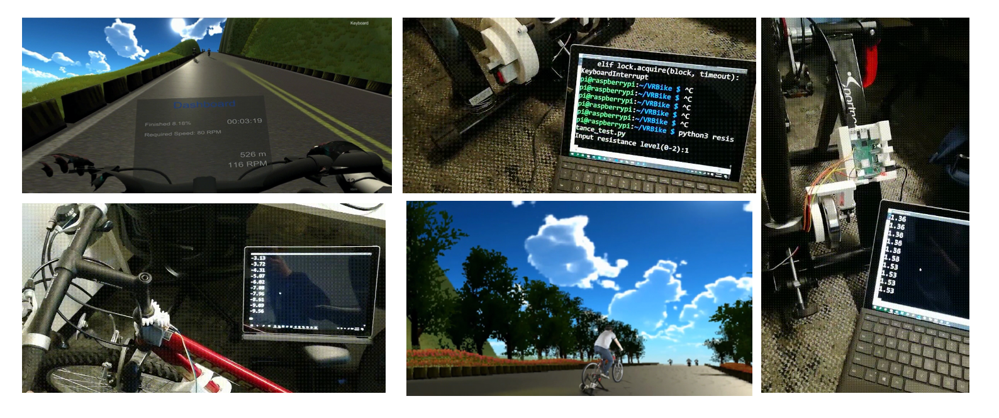
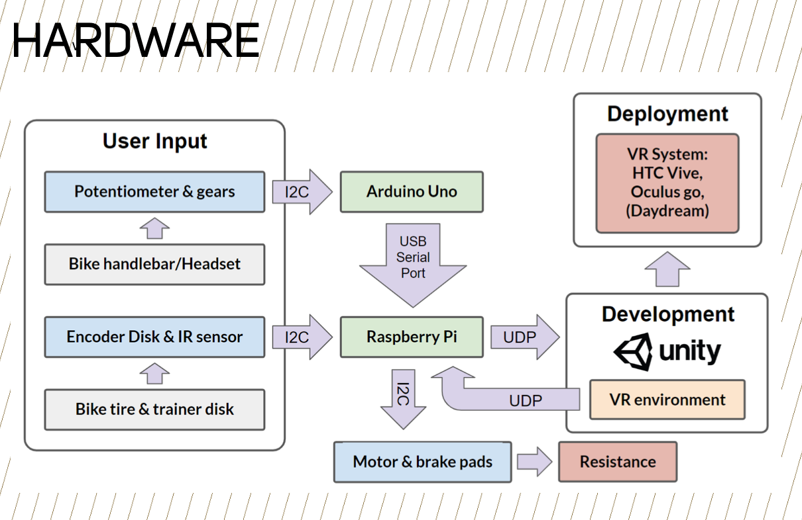
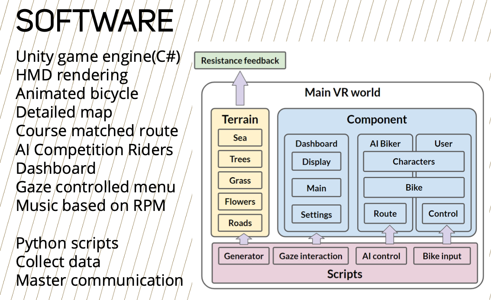

# VR Fitness Bike - VR Display Part

This repositoriy is used for the VR display part of VR Fitness Bike. It gets data from the sensor via Raspberry Pi and Arduino. The monitor part for Arduino and Raspberry Pi can be found [here](https://github.com/BerwinZ/VR-Fitness-Bike-Hardware-Controller).

The master branch is a bike game which includes the bike, biker with animation, well-designed route, map, and terrain, and other interactivate functions including camera switch, udp transit and etc.

Looking from a 3rd prespective is like following.

Other images about this repo. 

* Top left: first prespective in VR
* Top middle: wheel encoder for speed info
* Right: automatic resistance module for bike
* Bottom left: handle bar sensor for rotation info
* Bottom middle: third prespective

## Functions
This project is a simulated bike game. The speed of the bike and the turning can be controled external signal. The game can also be controled by keyboard or game handle(switch handle).

The control method and type are as follows.
* Go forward: `W` / left Y axis in handle
* Turn left: `A` / left X axis in handle
* Turn right: `D` / right X axis in handle
* Increase the speed: Up arrow / button `A` in handle
* Decrease the speed: Down arrow / button `B` in handle
* Switch to first / third person view: `F2` / button `R2` in handle
* Switch to keyboard / udp control mode: `F3`
* Little Restart: `R`
* Full Restart: Right `Shift` / button `Y` in handle

When the bike go forward, the speed is fixed, whatever terrain you are in.

## Required Environment
* Unity 2018.3.12f1
* Visual Studio 2017 or 2019

## Basic Game Logic

  
  

## GameObject and Script Overview

* Lights
* Manager
	* DuplicateRoads.cs: Generate road according to parameters
	* KeyboardControls.cs: Detect the input
	* ControlHub.cs: Contains all the variable which controls movement of bike
	* UdpControl.cs: Control the receive and send functions of UDP
	* CamSwitcher.cs: Control different cameras enability
* Bike
	* Bicycle_code.cs: Handle movement of the bike
	* Bicycle_body
		* Ethan
			* Biker_logic_mecanim.cs: Control the action of the biker
		* bicycle_pedals
			* PedalControls.cs: Control the action of pedals
	* Cameras
		* FirstView
		* ThirdView
		* AroundView 
* Route: Saved route
* Terrain: Designed terrain and other environmental elements.
* AIBiker

## Adopted Assets
* bicycle_pro_kit
* Standard Assets
